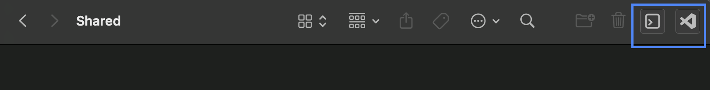

# mac-os-open-in-vscode
Automator apps to open files & folders in VS Code from Finder

This repo has two tiny utilities
- OpenInVSCode: Open any file or folder directly in Visual Studio Code from Finder
- Open Terminal Here: Open terminal at the current Finder location

## Add to Finder
- Download and extract the zip files
- Move them to the Applications folder
- Hold the command key and drag each one onto the Finder's toolbar
- Make sure your VS Code app is in the Applications folder and is named `Visual Studio Code.app`
- Select any file/folder and click on the app icon to open VS Code or the terminal

## How to edit the apps
- Open Automator
- Locate and open the app in Automator
- Update the script shown in the right-hand side pane
